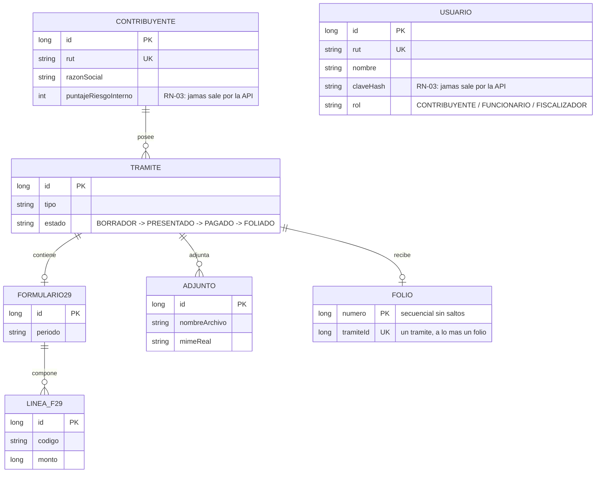

# SPEC-000 · Especificación maestra del curso Spring Boot SII 2026

| Campo | Valor |
|---|---|
| ID | SPEC-000 |
| Título | Especificación maestra: universo, dominio, reglas, arquitectura pedagógica y mapa de labs |
| Autor | Arquitecto |
| Aprueba | PO (Rodrigo) — **APROBADA** |
| Depende de | SPEC-001…SPEC-004 (andamiaje cerrado) |
| Estado | LISTA PARA EJECUCIÓN |

> **Instrucción de ejecución (mocito):** este documento es mayormente **normativo** — su
> ejecución consiste en versionarlo, apretar el último tornillo del andamiaje (§10.A),
> correr el único experimento que valida sus supuestos técnicos (§10.B) y registrar la
> bitácora (§10.C). Primer paso, como siempre: guardar este archivo íntegro en
> `docs/specs/SPEC-000-especificacion-maestra.md` y commitearlo antes de ejecutar.

---

## §1 · Propósito y jerarquía documental

Esta SPEC define el curso completo: el mundo donde ocurre, el dominio que se construye,
las reglas que se testean, la pedagogía que lo gobierna y el mapa de sus 12 laboratorios.
Toda SPEC posterior (app canónica, labs, slides, material de instructor) **se subordina a
este documento**; si una SPEC de lab contradice a la SPEC-000, gana la SPEC-000 o se
tramita un `-R1` de esta.

Jerarquía completa, de mayor a menor autoridad:

1. **El temario v3** (`docs/temario/`) — lo contractual: 36,0 h · 12×3 h · 15 módulos ·
   35 temas · 50/30/20. Intocable.
2. **Esta SPEC-000** — el diseño. Cambia solo por revisión (`-R1`) aprobada por el PO.
3. **Las SPEC de construcción** (SPEC-005 en adelante) — la ejecución.
4. **El ADN** (`docs/adn/`) — referencia justificativa, no normativa.

## §2 · Stack fijado

| Componente | Versión | Notas |
|---|---|---|
| Java | **25 LTS** (Temurin) | `java.version=25` en el `pom.xml`; baseline del framework: 17 |
| Spring Boot | **4.1.0** exacto | Vida útil hasta 2027-07-31; sin `^` ni rangos |
| Build | **Maven Wrapper** | Sin Gradle, sin Kotlin, **sin Lombok** (D-003 del traspaso, ratificada: Lombok esconde lo que hay que aprender) |
| Testing | JUnit **6** (Jupiter, del BOM) + Mockito + AssertJ + Awaitility | JUnit 4 no existe en Boot 4 |
| Testcontainers | **2.x** | Coordenadas nuevas (`testcontainers-postgresql`); la advertencia al alumno es contenido del M6 |
| ArchUnit | **1.4.x, artefacto `archunit` core** | **No** `archunit-junit5`: las reglas se escriben como `@Test` Jupiter comunes con `ClassFileImporter`, inmunes a la versión del runner. Validado por el spike §10.B |
| Base de datos | PostgreSQL, imagen con patch fijado | Tags verificados al 2026-07-09 (`postgres:16-alpine3.24`, `wiremock/wiremock:3.13.2-alpine`, `rabbitmq:4.2.4-management`, `prom/prometheus:v3.5.5`); **el ejecutor re-verifica los patch vigentes al fijarlos** en cada compose |
| Servicios externos | **WireMock** (D-002) | El curso enseña Spring Boot, no a escribir servidores de mentira |
| Mensajería | **RabbitMQ práctico, Kafka conceptual** (D-005) | Kafka son 6 GB de RAM y media sesión perdida |

## §3 · Universo narrativo

Heredado del curso de Cypress SII 2026 (D-011): quien tome ambos cursos reconoce el
mundo. Este curso construye **lo que hay detrás del botón** que el curso de Cypress
prueba desde afuera.

| Elemento | Definición |
|---|---|
| **DGT** | Dirección General de Tributación. Gemela ficticia del SII |
| **Mi DGT** | El portal del contribuyente (frontera del curso de Cypress) |
| **`dgt-tramites-api`** | El backend que este curso construye. La app canónica única, que crece lab a lab |
| **Carolina** | Jefa de la Plataforma de Trámites. La antagonista humana; misma jefa del curso de Cypress |
| **TESO** | Servicio de Tesorería. Confirma pagos. **Se cae con entusiasmo** (WireMock) |
| **CU** | ClaveÚnica simulada. Emite el JWT (segundo origen) |

Datos semilla heredados: `11111111-1` Valentina Rojas · `12345678-5` Comercial Andina
SpA. Los funcionarios (Carolina, Ignacio) son `Usuario`, no `Contribuyente`.

Tono canónico (sesión 1, Carolina):

> *"El año pasado te enseñé a probar el portal. Hoy te enseño lo que hay detrás del
> botón. Y te advierto una cosa: un folio emitido dos veces no se borra. Se explica.
> Ante un fiscalizador."*

## §4 · Dominio

Siete entidades:



- **Estados del trámite:** `BORRADOR → PRESENTADO → PAGADO → FOLIADO`, sin retrocesos ni
  saltos (la máquina de estados es testeable).
- **Ubicación de las entidades:** en `domain`, con anotaciones JPA (`jakarta.persistence`
  no es Spring; AU-03 lo permite). Bajarlas a `infrastructure` costaría un lab entero en
  mapeo, y este es un curso de Spring Boot, no de arquitectura hexagonal (resolución del
  traspaso, ratificada).
- **Tabla técnica `contador_folio`:** soporte del contador bloqueado (§5, RN-02). No es
  entidad de dominio; es detalle de infraestructura documentado en la migración que la
  crea.

## §5 · Reglas de negocio (se testean, no se comentan)

| ID | Regla | Cómo se verifica |
|---|---|---|
| **RN-01** | Un número de folio es **irrepetible** | `UNIQUE` en base de datos + test de concurrencia (Lab 06) |
| **RN-02** | Los folios son **secuenciales sin saltos** | Test que emite N folios y verifica la secuencia exacta; resolución técnica abajo |
| **RN-03** | `claveHash` y `puntajeRiesgoInterno` **jamás salen por la API** | AU-02 (estático) + test de contrato sobre el JSON serializado (dinámico): doble guardián |
| **RN-04** | Un trámite sin `Formulario29` no puede emitir folio | Test del servicio de emisión: excepción de dominio con `ProblemDetail` |
| **RN-05** | La emisión de folio es **idempotente por `tramiteId`** | `POST /tramites/{id}/folio`: la primera emisión responde **201** con el folio; todo reintento sobre el mismo trámite responde **200 con el mismo folio**, sin crear otro. La clave de idempotencia es el `tramiteId` — está declarada, luego es testeable |
| **RN-06** | `Formulario29.total` = suma de sus `LineaF29.monto` | **`total` es derivado**: método `total()` del agregado, **sin columna persistida**. Un invariante que necesita un test para sostenerse ya perdió; este no puede violarse. La migración del M8 agrega en cambio `CHECK (monto >= 0)` a `linea_f29`: la lección "restricciones como contratos" se enseña con una invariante que sí vive en la base |

**Resolución técnica del folio (RN-01 + RN-02):** contador bloqueado —
`SELECT … FOR UPDATE` sobre `contador_folio` **en la misma transacción** que persiste el
folio. Una `SEQUENCE` de PostgreSQL es no transaccional y siempre deja saltos, violando
RN-02. **`REQUIRES_NEW` es el intento ingenuo del Lab 06**: parece la solución obvia y
deja huecos en el libro de folios cuando la transacción externa revierte.

## §6 · Reglas ArchUnit — las reglas de la casa, compiladas

No son consejos: son tests que fallan. **El mensaje `because(...)` nombra el crimen, no
la regla** (ej.: *"Un controlador jamás toca la entidad. Ese fue el folio filtrado
(Lab 02)."*).

| ID | Regla | Entra en |
|---|---|---|
| AU-01 | `..web..` no depende de `..domain.entity..` | Lab 02 |
| AU-02 | Ninguna `@Entity` es alcanzable desde un `@RestController` — **incluidos los parámetros de tipo genéricos** (`ResponseEntity<Contribuyente>`, `Page<Contribuyente>`) | Lab 02 |
| AU-03 | `..domain..` no depende de `..web..` ni de `org.springframework..` | Lab 02 |
| AU-04 | Todo `@ManyToOne` y `@OneToOne` declara `fetch = LAZY` **explícitamente** | Lab 04 |
| AU-05 | Ningún test contiene `Thread.sleep` (se usa Awaitility) | Lab 03 |
| AU-06 | Ningún bean se inyecta por campo (constructor siempre) | Lab 02 |
| AU-07 | `..infrastructure..` no depende de `..web..` | Lab 02 |

**Notas de implementación (vinculantes):**

1. Las reglas usan el artefacto **`archunit` core** y corren como `@Test` Jupiter
   comunes con `ClassFileImporter` — sin `@AnalyzeClasses`, sin dependencia del runner.
2. AU-02 se escribe razonando sobre **dependencias** (`dependOnClassesThat()`), nunca
   sobre tipos de retorno crudos (`haveRawReturnType` fue la trampa: pasa en verde
   mientras el folio se filtra por el genérico). El spike §10.B lo comprueba con
   evidencia antes de que exista el primer lab.
3. **Meta-regla (la mejor idea de la auditoría de Cypress):** toda regla ArchUnit se
   entrega con su **fixture negativo** — una clase que la viola a propósito, y un test
   que verifica que la regla la caza. *Un guardián sin prueba de que muerde es un
   adorno.* Los fixtures viven en `src/test/java/.../fixtures/violaciones/`, excluidos
   del classpath de producción.

## §7 · Arquitectura pedagógica

### 7.1 La sesión canónica (180 min)

| Bloque | Min | Quién |
|---|---|---|
| 🔪 **La escena del crimen** | 10 | El relator, **en vivo** (D-009: abre la sesión, no el lab — motiva la teoría en vez de repetirla) |
| 📚 Teoría (deck) | ~40 | El relator |
| ☕ Descanso | 10 | — |
| 🔧 Laboratorio | ~110 | El alumno |
| ✅ Cierre: validar · reporte · siembra | 10 | Ambos |

Reparto aproximado: **~30 % teoría · ~70 % práctica** (compromiso del temario; no se
declara "exacto" porque no lo es: 50/170 ≈ 29,4 %, y el rigor no es un traje que se pone
solo para auditar al vecino).

### 7.2 El presupuesto de TODOs (D-010, enmendada)

**4 a 5 `{{TODO}}` por lab, ~15 minutos cada uno** (≈75 min de tecleo, ≈35 de lectura y
cierre). Todo lo demás viene escrito, funcionando y con Javadoc que explica el porqué:
la palanca no es recortar contenido, es mover piezas de "el alumno teclea" a "el alumno
lee". **Se hace más corto sin hacerse más fácil**: el criterio de aceptación no se toca.

### 7.3 Anatomía obligatoria de un `{{TODO}}`

En este orden: (1) Javadoc completo — el autocompletado funciona antes de escribir nada;
(2) andamio presente — firma, tipos, estructura; (3) `// TODO N —` con el *qué*, el
*porqué* y la regla de negocio (`RN-04`); (4) `// Pista 2:` inline (la Pista 1 vive en
la guía; la Pista 3, en `solucion/`); (5) el marcador **compilable**:

```java
throw new UnsupportedOperationException("{{TODO_3}}");
```

### 7.4 Las cinco piezas no negociables de un lab

1. **El crimen**, vivido en los primeros 10 minutos. No contado.
2. **Un criterio de aceptación medible** que no se apruebe tecleando más código (el
   arquetipo: el test que cuenta consultas SQL del Lab 05).
3. **El reporte entregable** (o la autopsia: hipótesis · evidencia · corrección ·
   detección). El validador mide el estado; el reporte mide la cabeza. Los reportes
   piden **transcribir errores exactos**, no opinar sobre ellos (P-11).
4. **El validador con dos modos:** `90-validar.sh --dir starter | --dir solucion`. El
   mismo criterio juzga a ambos: no hay dos verdades (P-14).
5. **ArchUnit vigilando** desde el Lab 02, cada regla con su fixture negativo (§6).

### 7.5 Reglas pedagógicas adoptadas del ADN (vinculantes)

- **Tres actos** (P-10): choque → **parche bruto que FUNCIONA** (y se cuestiona su
  costo) → forma correcta. Cada crimen del mapa §9 declara su acto 2 en la SPEC del lab
  (el N+1 se "arregla" con EAGER; el folio duplicado, con `synchronized`; el timeout,
  subiéndolo global).
- **Lo opcional nunca baja el veredicto** (P-15, corregida): el desafío `99-` ausente es
  SKIP; presente y roto es FAIL visible que **no toca el gate**. Contador aparte.
- **El antes y el después conviven** (P-16): el Lab 05 versiona `solucion-con-n1/` y
  `solucion/`; el `90` exige que **ambas pasen la suite funcional** y que solo la
  segunda pase el contador de consultas — la definición ejecutable de refactorizar.
- **La escalera colapsada** (P-06): el Lab 08 colapsa las formas acumuladas de llamar a
  TESO (RestClient crudo → con timeout → `@HttpExchange` → con circuit breaker) en un
  solo puerto del dominio con estrategias.
- **Sabotaje por bandera** (P-04): `start-lab.sh --lotes N | --concurrencia N | --caos`,
  con WARN pedagógico **condicional** que nombra la guía exacta cuando el valor cruza el
  umbral que importa.
- **Siembra obligatoria** (P-18): toda `TEORIA.md` de lab con sucesor siembra el
  siguiente. El CI ya está armado y se activará solo con el primer lab.
- **La trampa registrada** (decisión nueva, no herencia — en Cypress nunca existió,
  N-01): la plantilla de reporte incluye la casilla *"¿Consultaste `solucion/`? ¿En qué
  actividad y por qué?"*. Mirar la solución no está prohibido: está registrado. Se
  evalúa la honestidad, no la pureza.
- **Integridad del enunciado, acotada** (corrección al traspaso): el
  `manifiesto-tests.sha256` protege **solo** `src/test/java/**/enunciado/**`. Los tests
  que el alumno escriba por iniciativa propia son territorio libre — el manifiesto jamás
  castiga al alumno bueno.
- **Boletín de tres ejes para el egreso** (P-05): Correctitud (auto — e incluye "pipeline
  deshonesto" como Insuficiente), Oficio (semi-auto: ArchUnit limpio, sin `@Disabled`
  sobre el enunciado, **sin flaky**: el `91` corre la suite 3 veces y si difiere lo
  declara), Criterio (humano, con guía del instructor: preguntas para destapar criterio,
  respuestas calibradas por nivel y la gramática del feedback — fortaleza primero, cada
  crítica convertida en acción). Umbral: **Núcleo verde Y Criterio ≥ Suficiente**.

### 7.6 Anatomía del laboratorio (estructura obligatoria)

```
lab-NN-nombre/
├── README.md               # narrativa · objetivos · mapa · tiempos · "Para el Instructor"
├── TEORIA.md               # §§ numerados · analogías · DO/DON'T · glosario · siembra
├── TESTS.md                # qué prueba cada test y qué RN verifica
├── INSTRUCTOR.md           # ORDEN PARA CLASE minutado · demos · el error que cometerá la sala
├── diagramas/*.mermaid     # nunca PNG
├── guia/                   # 01-contexto · 02-vive-el-problema · 03-el-intento-ingenuo · 99-desafio
├── desafio/                # pista libre: solo el criterio de aceptación
├── starter/                # {{TODO_N}} + Pista 2 + Javadoc completo
├── solucion/               # "compara, no copies" (+ solucion-con-n1/ donde aplique)
├── plantillas/             # reporte-entregable.md · autopsia.md
├── bin/                    # 00-verificar · start-lab · 90-validar · 91-e2e · 95-recuperar · 99-destruir · lib-comunes.sh
└── docs/troubleshooting.md # tabla numerada, filas citables
```

Convenciones de scripts (heredan las del repo): bash portable (macOS bash 3.2 / Git
Bash), sin Python en el `bin/` del alumno, sin ANSI (`[OK]/[INFO]/[WARN]/[ERROR]`),
contadores dinámicos, `90` de solo lectura que acumula fallas sin `set -e`, `95`
respalda antes de sobrescribir, **encadenamiento verificado por el `91`**: la
`solucion/` del lab N es el `starter/` del lab N+1 más los huecos nuevos, y el paso
canónico del `91` es `90 --dir starter` virgen → **exit 1** → `95` → `90` → **exit 0**
(demuestra que el starter está genuinamente incompleto *y* que tiene solución). En Java,
**el criterio de aceptación se verifica con tests compilados y ArchUnit; bash solo
orquesta, jamás inspecciona código con regex** (anti-herencia A-01).

## §8 · Evaluación del curso

Conforme al temario: Proyecto final 50 % (rúbrica del temario v3, 6 criterios) ·
Evaluación de conocimientos 30 % · Ejercicios 20 % (reportes entregables de los labs).
El Lab 12 es el **examen de egreso**: brief de negocio (no instrucciones), starter casi
vacío, boletín de tres ejes (§7.5). La solución de referencia lleva su `NOTA.md`: *"esta
es UNA solución, no LA solución"*.

## §9 · El mapa de 12 laboratorios, amarrado a la matriz

Un lab por sesión; mismo repositorio, creciendo. La columna Módulos coincide **célula
por célula** con la Matriz Módulo × Sesión del temario v3 (verificada en CI).

| Sesión | Lab | Título | Módulos (h) | El crimen |
|---|---|---|---|---|
| — | 00 | Estación Base *(previa, no computable)* | — | — |
| S01 | 01 | Del otro lado del botón | M1 (2,0) + M2 (1,0) | La contraseña de la BD versionada en `application.yml` |
| S02 | 02 | El folio que se filtró | M2 (1,5) + M3 (1,5) | `GET /contribuyentes/{rut}` serializa la entidad: viajan `claveHash` y `puntajeRiesgoInterno` |
| S03 | 03 | Red de seguridad | M3 (1,5) + M4 (1,5) | **La suite llega en rojo: 14 tests.** Los tests *son* el enunciado |
| S04 | 04 | El árbol de trámites | M5 (3,0) | Todo viene en `FetchType.EAGER`, "porque así funcionaba". Nadie lo nota. Ese es el punto |
| S05 | 05 | **Once segundos** | M5 (1,0) + M6 (1,5) + M7 (0,5) | `--lotes 50000` → el listado tarda 11 s → 1.847 consultas. Acto 2: EAGER "lo arregla" |
| S06 | 06 | Dos folios, un número | M7 (1,5) + M8 (1,5) | Bajo `--concurrencia 2`, dos contribuyentes reciben el mismo folio. Acto 2: `REQUIRES_NEW` / `synchronized` |
| S07 | 07 | El portero | M9 (3,0) | — (construcción: JWT a mano para entender, Resource Server para vivir) |
| S08 | 08 | Diplomacia con Tesorería | M9 (1,0) + M10 (2,0) | WireMock con `fixedDelay: 30000`: sin timeout, el pool se agota y **toda la API muere esperando un pago** |
| S09 | 09 | Caja negra | M10 (0,5) + M11 (2,5) | *"Se emitió un folio a un contribuyente equivocado. Tengo 400 MB de logs. Encuéntramelo."* |
| S10 | 10 | Latidos | M11 (0,5) + M12 (2,0) + M13 (0,5) | El cierre nocturno se ejecutó **dos veces**: `fixedRate` en dos instancias |
| S11 | 11 | Amortiguadores | M13 (2,0) + M14 (1,0) | 200 mensajes, un consumidor caído: DLQ, idempotencia, circuit breaker |
| S12 | 12 | Cápsula y egreso | M14 (1,0) + M15 (2,0) | — (examen de egreso con brief y rúbrica) |

Clímax narrativo canónico (Lab 05, Carolina):

> *"Ayer el listado de trámites tardó once segundos. Hoy, veintitrés. No agregamos
> código: agregamos trámites. No quiero oír la palabra 'optimizar' hasta que me muestres
> un número."*

## §10 · Ejecución de esta SPEC

### A · El último tornillo: enchufar el gate

1. Configurar **branch protection** en `main`: required status checks `temario` y
   `siembra`; prohibido el push directo. **Desde ya, toda SPEC va por rama** con PR —
   se deroga la cláusula transitoria de la gobernanza v2 ("directo a main mientras no se
   dicte"): una sola regla es mejor que dos con fecha de cambio, y el PR es el punto de
   revisión natural del PO.
2. Registrar en `decisiones.md` **dos filas**: (a) la protección de `main` con la
   derogación de la cláusula transitoria; (b) **el rojo del temario es un semáforo, no
   una falla**: si el `.md` cambia y el `.docx` diverge, el rojo significa "avisa al
   arquitecto para regenerar el build" — no se regenera en CI (un build automático sin la
   línea gráfica del entregable es peor que un rojo honesto). Se revisita si las
   ediciones se vuelven frecuentes.
3. Actualizar la sección "Protocolo SPEC" del README con la regla derogada/nueva.

### B · Spike S-1: ArchUnit sobre Boot 4.1 (única validación técnica pendiente)

Proyecto Maven **desechable** (fuera del repo o en rama `spike/archunit`, a tu juicio —
si va en rama, no se mergea: se cierra con el reporte). Responder **con comando y salida
citada**:

1. Con Boot **4.1.0** y el artefacto **`archunit` core 1.4.x** (sin `archunit-junit5`):
   ¿corre una regla trivial como `@Test` Jupiter bajo `./mvnw test`?
2. ¿`dependOnClassesThat()` caza una dependencia declarada **solo en un parámetro de
   tipo genérico de retorno** — un `@RestController` que devuelve
   `ResponseEntity<Contribuyente>` hacia `..domain..`? Escribir la clase que viola
   (el fixture negativo) y comprobar que la regla **falla** con ella y **pasa** sin ella.
3. Veredicto: `VIABLE` / `VIABLE CON AJUSTE (detallar)` / `NO VIABLE`.

Si (2) falla, **AU-02 necesita reescritura**: reportar el hallazgo con la salida — la
redacción de AU-02 en §6 se corrige entonces vía `SPEC-000-R1`, no se improvisa.

### C · Bitácora

Además de las dos filas de §10.A, registrar:

| Fecha | Decisión | Razón |
|---|---|---|
| (fecha de ejecución) | Se adopta la SPEC-000 como especificación maestra del curso: universo DGT, 7 entidades, RN-01…06 (RN-05 idempotente por `tramiteId`; RN-06 como derivado sin columna), AU-01…07 con fixture negativo obligatorio y ArchUnit core sin dependencia del runner, sesión canónica 10/40/10/110/10, presupuesto 4–5 TODOs, mapa de 12 labs amarrado a la matriz del temario. | Todo lo que el curso predica se compila en algo que muerde; la SPEC-000 es el contrato del que cuelgan todas las SPEC de construcción. |

## §11 · Criterios de aceptación

- [ ] SPEC-000 commiteada antes que sus cambios (y por rama + PR, estrenando §10.A).
- [ ] Branch protection activa: push directo a `main` rechazado (probar y citar el rechazo).
- [ ] `decisiones.md` con las tres filas nuevas.
- [ ] README con el protocolo actualizado.
- [ ] Spike S-1 ejecutado: veredicto con comandos y salidas citadas; fixture negativo del punto 2 incluido en el reporte.
- [ ] Commits con prefijo `SPEC-000:`; PR mergeado con checks verdes citados.

## §12 · Reporte

Veredicto del spike (completo), evidencia del push directo rechazado, URL del PR y de su
run verde, `git log --oneline`, discrepancias y hallazgos del ejecutor (sin tocarlos).

## §13 · Roadmap posterior (informativo, no ejecutable aquí)

SPEC-005: app canónica `dgt-tramites-api` (esqueleto, 7 entidades, Flyway V1, seeds,
ArchUnit AU-01…07 con fixtures) → SPEC-006: andamiaje `bin/` común + Lab 00 →
SPEC-007…018: labs 01–12 (una SPEC por lab, cada una declarando crimen, acto 2, TODOs y
criterio de aceptación) → SPEC de slides (`guion-slides-modNN.md` → `.pptx` **con notas
del orador**) → SPEC de material de instructor (coreografías de pizarra, "para la
abuelita", "el error que cometerá la sala").
